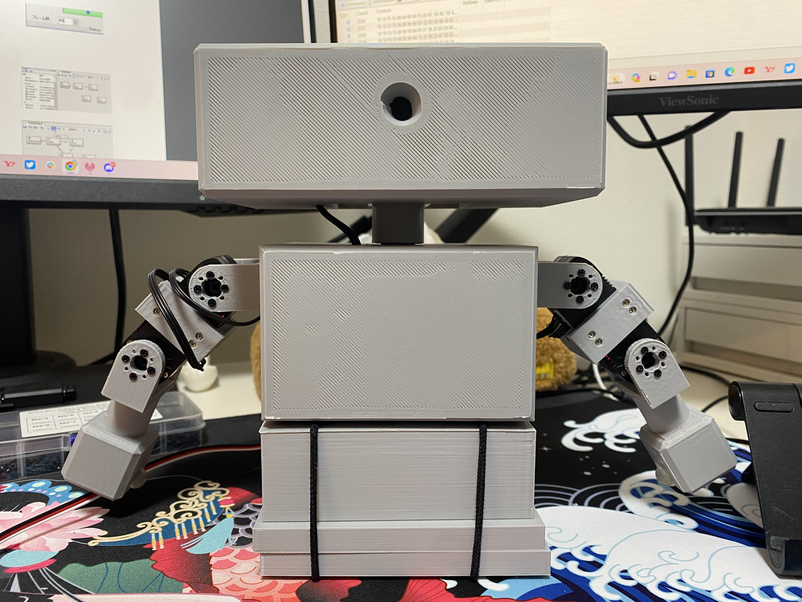

# TabletopTwin
A tabletop robot for better telecomunication!

## Mediapipe
Install MediaPipe and OpenCV to run the pose detection algorithm. 
```
python -m pip install --upgrade pip
pip install --upgrade --user mediapipe
pip install opencv-python
```

## Items
- Arduino Uno R3 x1
- KRS-3301 x8
- ICS Conversion Circuit x1
- 7V AC Adapter x1
- RCB-4 x1

## Product


### Mimicking Demonstration


### HeartToHeart4 Motion Demonstration


## References

https://kondo-robot.com/faq/ics35mag
